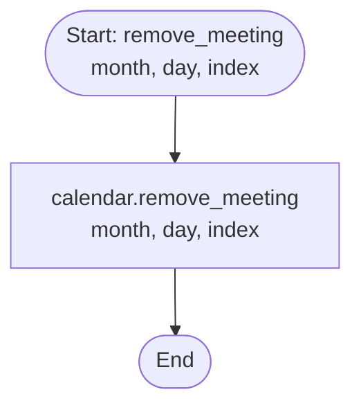

# Control Flow Graph (CFG) - Room Class

## Overview

The Room class acts as a wrapper around the Calendar class. Most methods delegate directly to the internal calendar object with added context (room ID) for error messages.

---

## 1. Room.__init__() CFG

**Paths**: 1 (sequential only)

---

## 2. Room.get_id() CFG

**Paths**: 1 (sequential only)

---

## 3. Room.add_meeting() CFG

**Paths**: 2 (success or exception)

**Key Feature**: Wraps calendar exception with room-specific context

---

## 4. Room.print_agenda() CFG

**Paths**: 2 (month-only vs. month+day)

---

## 5. Room.is_busy() CFG

**Paths**: 1 (direct delegation)

---

## 6. Room.get_meeting() CFG

**Paths**: 1 (direct delegation)

---

## 7. Room.remove_meeting() CFG

**Paths**: 1 (direct delegation)

---

## Summary

**Architecture**: Delegation Pattern
- Room delegates to internal Calendar for all scheduling logic
- Adds room-specific context to exceptions
- Provides room identification via `get_id()`

**Total Paths**: 9 across all methods
- Most are simple delegations
- Only `add_meeting()` and `print_agenda()` have branches

**Statement Coverage**: Easy to achieve 100% as most methods are single-path delegations
