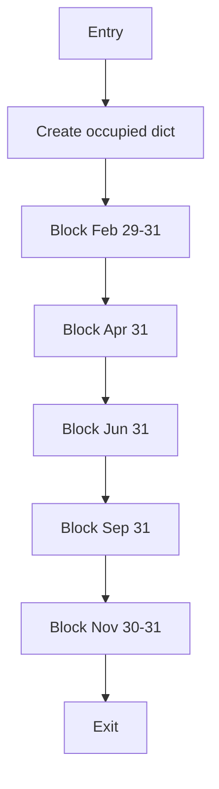
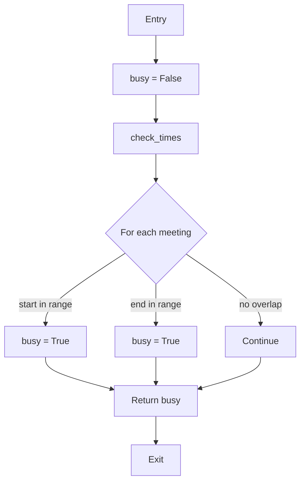
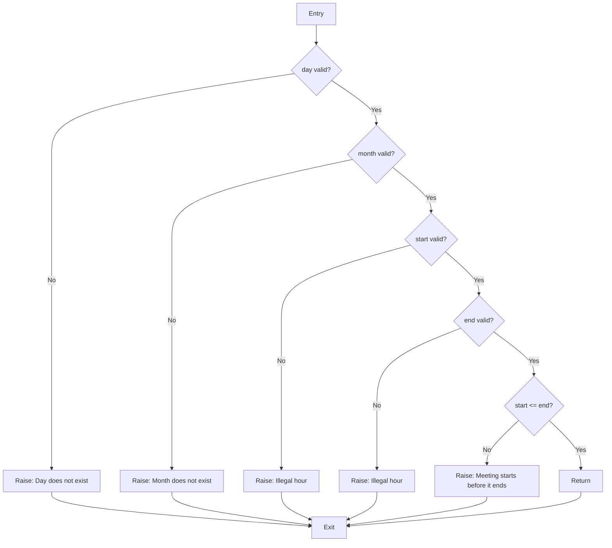
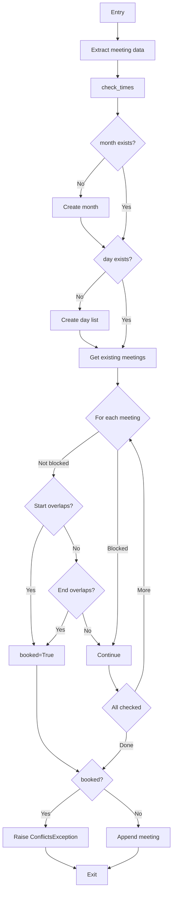

# Control Flow Graphs (CFG) Documentation

## CSI3105 Software Testing Case Study
**Author**: Test Team  
**Purpose**: Document control flow graphs for all methods in Calendar, Meeting, Person, and Room classes

---

## Calendar Class

### Calendar.__init__()

**Purpose**: Initialize calendar structure and block invalid days

**Cyclomatic Complexity**: 1 (sequential execution, no branches)

**Control Flow**:
```
1. Entry
2. Create nested dictionary for months/days  
3. Block Feb 29, 30, 31
4. Block Apr 31
5. Block Jun 31
6. Block Sep 31
7. Block Nov 30, 31
8. Exit
```

**Paths**: 1 path (sequential)

**Mermaid Diagram**:


---

### Calendar.is_busy()

**Purpose**: Check if time slot has conflicting meetings

**Cyclomatic Complexity**: 4

**Control Flow**:
```
1. Entry
2. Set busy = False
3. Call check_times (validation)
4. Loop through meetings for that day
   5a. If start >= existing start AND start <= existing end: set busy = True
   5b. Elif end >= existing start AND end <= existing end: set busy = True
6. Return busy
7. Exit
```

**Paths**:
1. No meetings → path: 1→2→3→6→7
2. Meetings exist, no overlap → path: 1→2→3→4→6→7
3. Meetings exist, start overlaps → path: 1→2→3→4→5a→6→7
4. Meetings exist, end overlaps → path: 1→2→3→4→5b→6→7

**Mermaid Diagram**:


---

### Calendar.check_times() [static]

**Purpose**: Validate month, day, and hour parameters

**Cyclomatic Complexity**: 6 (5 if statements + 1 base path)

**Control Flow**:
```
1. Entry
2. If day < 1 or day > 30: raise exception → Exit
3. If month < 1 or month >= 12: raise exception → Exit
4. If start < 0 or start >= 23: raise exception → Exit
5. If end < 0 or end > 23: raise exception → Exit  
6. If start > end: raise exception → Exit
7. Return (valid)
8. Exit
```

**Paths**:
1. All valid → 1→2→3→4→5→6→7→8
2. Invalid day → 1→2→Exit
3. Invalid month → 1→2→3→Exit
4. Invalid start → 1→2→3→4→Exit
5. Invalid end → 1→2→3→4→5→Exit
6. Start > end → 1→2→3→4→5→6→Exit

**Mermaid Diagram**:


---

### Calendar.add_meeting()

**Purpose**: Add meeting to calendar with conflict checking

**Cyclomatic Complexity**: 8

**Control Flow**:
```
1. Entry
2. Extract month, day, start, end from meeting
3. Call check_times (validation)
4. If month not in occupied: create month dict
5. If day not in occupied[month]: create day list
6. Loop through existing meetings on that day
   7a. If description != "Day does not exist":
       8a. If new start overlaps existing: set booked=True, conflict=meeting
       8b. Elif new end overlaps existing: set booked=True, conflict=meeting
9. If booked: raise ConflictsException → Exit
10. Else: append meeting to day list
11. Exit
```

**Paths**: Multiple paths based on dict structure and conflicts

**Mermaid Diagram**:


---

## Room Class

### Room.__init__()

**Cyclomatic Complexity**: 1 (sequential)

**Paths**: 1 - Initialize id and create Calendar instance

---

### Room.add_meeting()

**Cyclomatic Complexity**: 2 (try-except)

**Control Flow**:
```
1. Entry
2. Try: calendar.add_meeting(meeting)
   3a. Success → Exit
   3b. ConflictsException → Catch and re-raise with room context → Exit
```

---

### Room.is_busy()

**Cyclomatic Complexity**: 1 (direct delegation)

**Paths**: 1 - Delegate to calendar.is_busy()

---

### Room.print_agenda()

**Cyclomatic Complexity**: 2 (if-else for day parameter)

**Control Flow**:
```
1. Entry
2. If day is None: return calendar.print_agenda(month) → Exit
3. Else: return calendar.print_agenda(month, day) → Exit
```

---

## Person Class

Person class methods have identical structure to Room class:

- `__init__()`: CC=1 (initialize name and calendar)
- `add_meeting()`: CC=2 (try-except with context wrapping)
- `is_busy()`: CC=1 (delegate to calendar)
- `print_agenda()`: CC=2 (if-else for day parameter)
- `get_meeting()`: CC=1 (delegate to calendar)
- `remove_meeting()`: CC=1 (delegate to calendar)

---

## Meeting Class

### Meeting.__init__()

**Cyclomatic Complexity**: 2 (conditional for attendees default)

**Control Flow**:
```
1. Entry
2. Initialize all fields
3. attendees = attendees if attendees is not None else []
4. Exit
```

---

### Meeting.add_attendee()

**Cyclomatic Complexity**: 1

**Paths**: 1 - Append to attendees list

---

### Meeting.remove_attendee()

**Cyclomatic Complexity**: 1

**Paths**: 1 - Remove from attendees list

---

### Meeting.__str__()

**Cyclomatic Complexity**: 3

**Control Flow**:
```
1. Entry
2. Build info string with meeting details
3. If room exists: get room.get_id(), else "N/A"
4. If attendees exist: join names, else "No attendees"
5. Return info string
6. Exit
```

---

### Meeting Getters/Setters

All getter and setter methods have:
- **Cyclomatic Complexity**: 1
- **Paths**: 1 (direct get/set)

---

## Summary Statistics

| Class | Methods | Avg CC | Max CC | Total Paths |
|-------|---------|--------|--------|-------------|
| Calendar | 11 | 3.1 | 8 | ~25 |
| Room | 7 | 1.3 | 2 | 9 |
| Person | 7 | 1.3 | 2 | 9 |
| Meeting | 18 | 1.2 | 3 | 20 |
| **Total** | **43** | **1.9** | **8** | **~63** |

---

## Key Insights

1. **Calendar.add_meeting()** has the highest complexity (CC=8) due to conflict detection logic
2. **Calendar.check_times()** has 6 validation branches - source of multiple bugs
3. **Room and Person classes** are thin wrappers around Calendar - low complexity
4. **Meeting class** is primarily data storage with simple getters/setters

---

## Test Coverage Implications

To achieve 100% statement coverage:
- Calendar class requires tests for all 6 validation paths in check_times()
- Calendar class requires tests for conflict detection (both start and end overlap cases)
- Room/Person classes require tests for exception wrapping in add_meeting()
- Meeting class requires tests for optional parameters (attendees, room)
