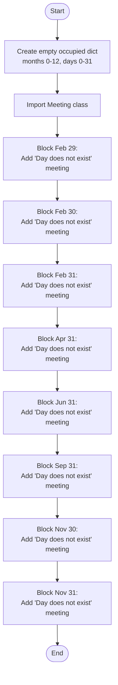
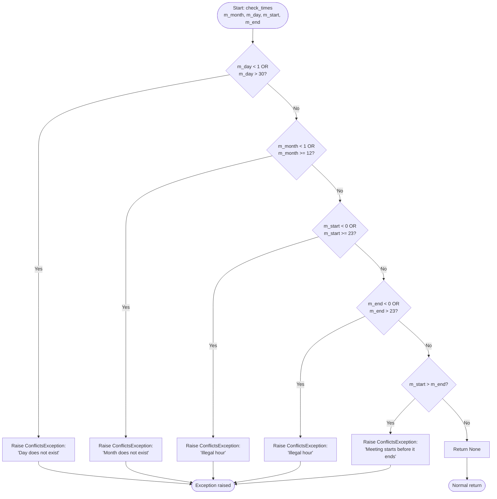
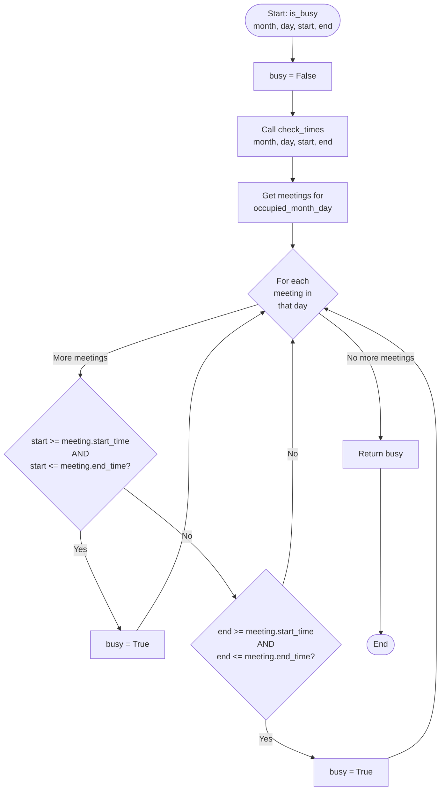
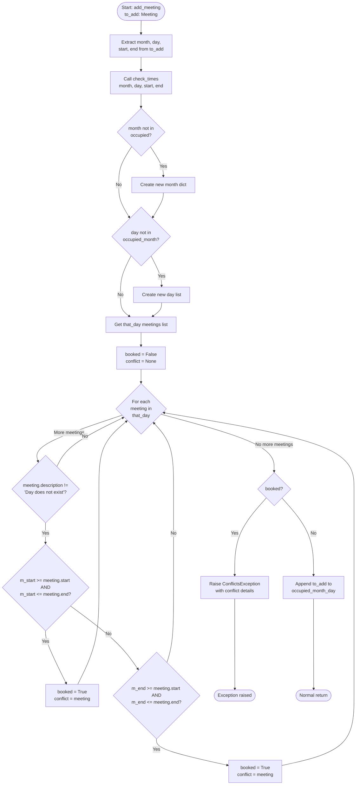
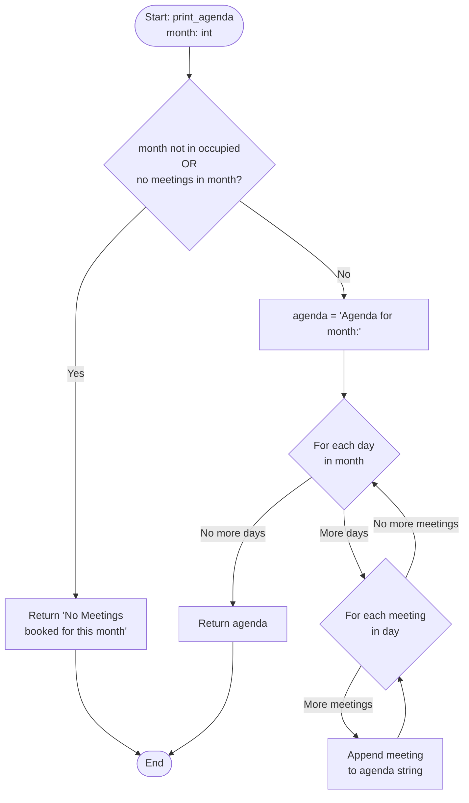
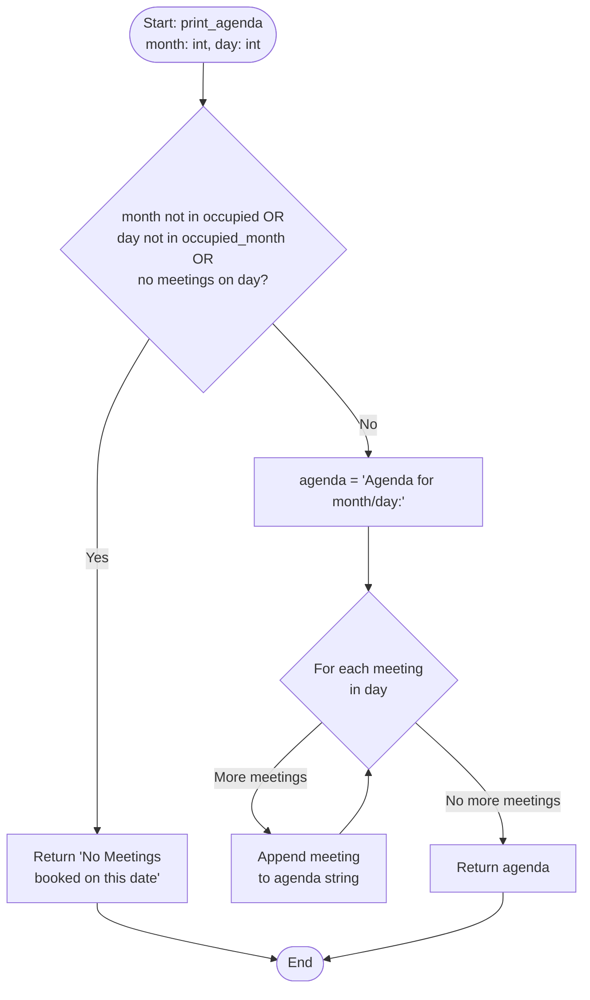
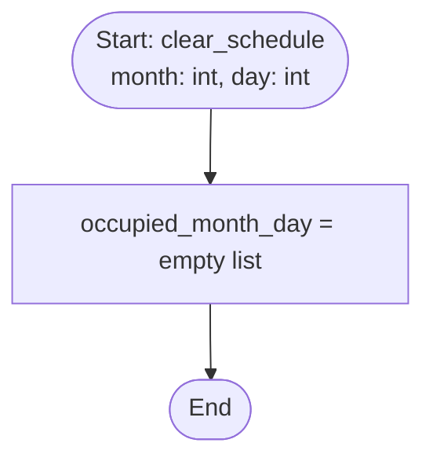
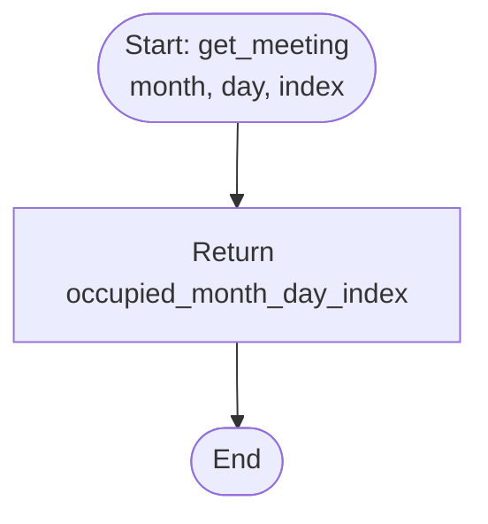
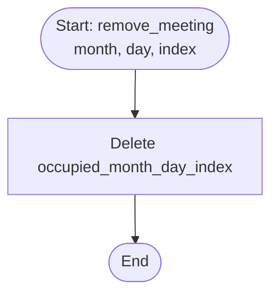

# Control Flow Graph (CFG) - Calendar Class

## Overview

This document presents the Control Flow Graphs for key methods in the Calendar class. CFGs visualize the control flow through each method, showing all decision points and execution paths.

## CFG Notation

- **Rectangular nodes**: Statements/blocks of code
- **Diamond nodes**: Decision points (if/else, loops)
- **Edges**: Control flow paths
- **Node numbers**: For reference

---

## 1. Calendar.__init__() CFG

**Paths**: 1 (sequential execution only)

**Defect**: Line 28 incorrectly blocks November 30, which is a valid date!

---

## 2. Calendar.check_times() CFG

**Paths**: 6 (1 normal + 5 exception)

**Defects**:
- Line 63: `m_day > 30` should be month-specific or at least `> 31`
- Line 65: `m_month >= 12` should be `> 12` (December is month 12, valid!)
- Line 67: `m_start >= 23` should be `> 23` (hour  23 is 11 PM, valid!)

---

## 3. Calendar.is_busy() CFG

**Paths**: Multiple (depends on number of meetings and overlap conditions)

---

## 4. Calendar.add_meeting() CFG

**Paths**: Many (branch combinations + loop iterations)

---

## 5. Calendar.print_agenda(month) CFG

**Paths**: 2 main paths (empty vs. non-empty month)

---

## 6. Calendar.print_agenda(month, day) CFG

**Paths**: 2 main paths (empty vs. non-empty day)

---

## 7. Calendar.clear_schedule() CFG

**Paths**: 1 (sequential only)

---

## 8. Calendar.get_meeting() CFG

**Paths**: 1 (may raise IndexError if index invalid)

---

## 9. Calendar.remove_meeting() CFG

**Paths**: 1 (may raise IndexError if index invalid)

---

## Summary

**Total Paths Analyzed**: Calendar class has multiple paths due to decision points in:
- `check_times()`: 6 paths
- `is_busy()`: Variable (based on meetings)
- `add_meeting()`: Many paths (complex branching)
- `print_agenda()`: 2-3 paths each overload
- Simple methods: 1 path each

**Statement Coverage Goal**: 100% - requires executing all paths including exception paths.
